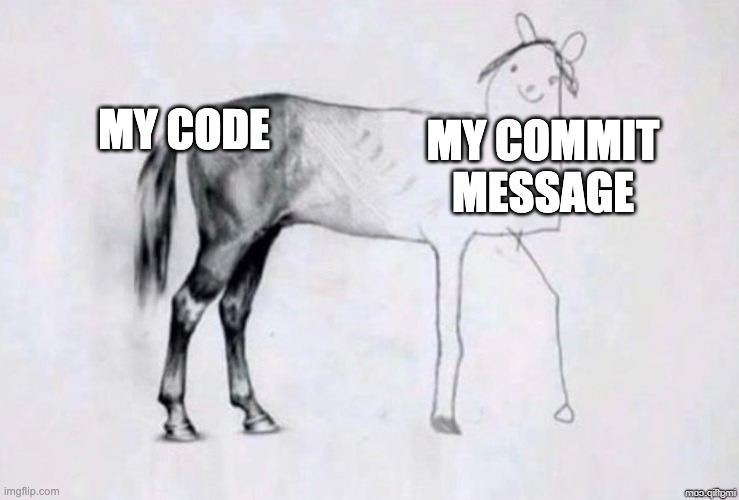

# commit-this

A Claude Code skill that reads your staged changes (or last unpublished commit), generates a [Conventional Commits](https://www.conventionalcommits.org/) message with a gitmoji prefix, and offers to run `git commit` for you. Invoke it with `/commit-this` — no arguments needed.

### Cost
100 - 300 tokens per run

## Installation

**Recommended — one-line install:**

```bash
curl -fsSL https://raw.githubusercontent.com/andychanfp/commit-this/main/install.sh | bash
```

**Or clone manually:**

```bash
git clone https://github.com/andychanfp/commit-this.git ~/.claude/skills/commit-this
```

Claude Code picks up skills automatically from `~/.claude/skills/<name>/SKILL.md`. No further registration is needed — verify it with `/help`.

## How it works

1. **Validate** — confirms you're in a git repo and detects whether to read staged changes or the last unpublished commit.
2. **Read** — runs `git diff --staged` (or `git show HEAD` as fallback) to capture the full diff.
3. **Generate** — classifies the change type, infers scope from changed file paths, checks for breaking changes, and picks the matching gitmoji.
4. **Emit** — outputs a single `git commit -m "..."` line and asks `Commit? (yes / no)`.
5. **Commit** — on `yes`, runs the command and reports the resulting SHA. On `no`, exits silently.

## Expected output

```
git commit -m "✨ feat(auth): add OAuth2 login flow"

Commit? (yes / no)
```

For larger or breaking changes, a body and `BREAKING CHANGE:` footer are included automatically.